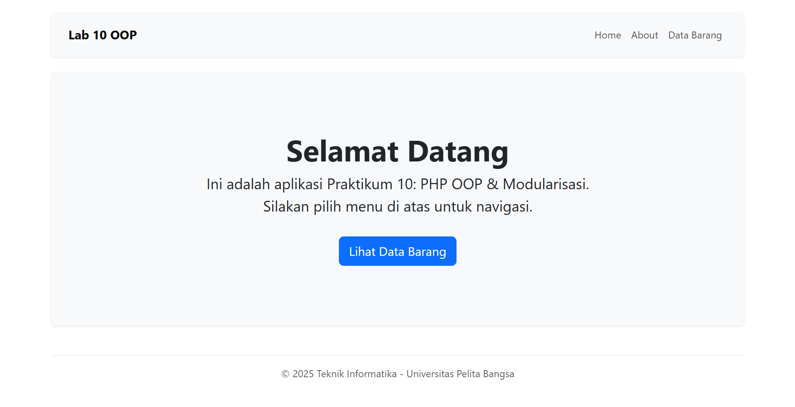
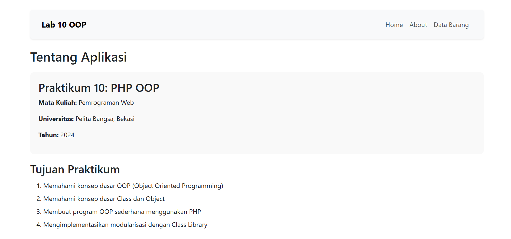
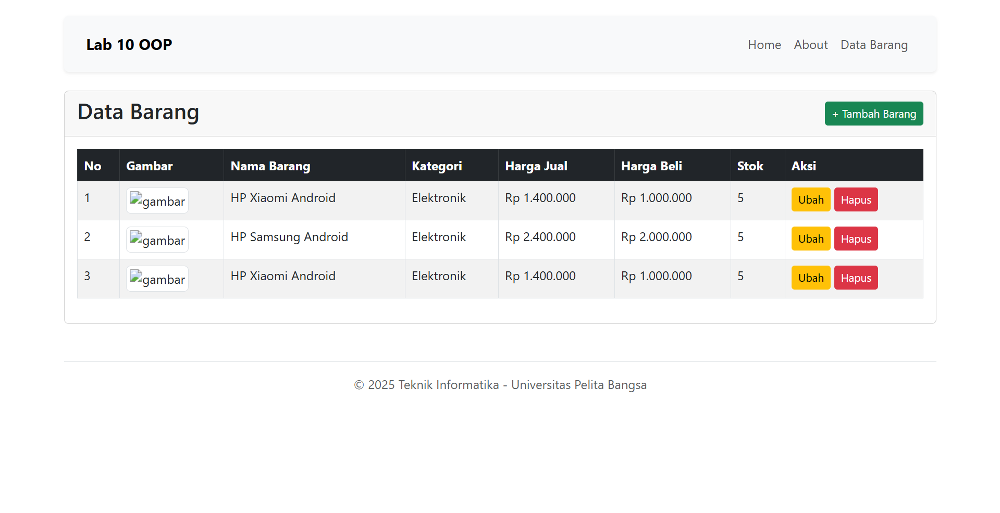
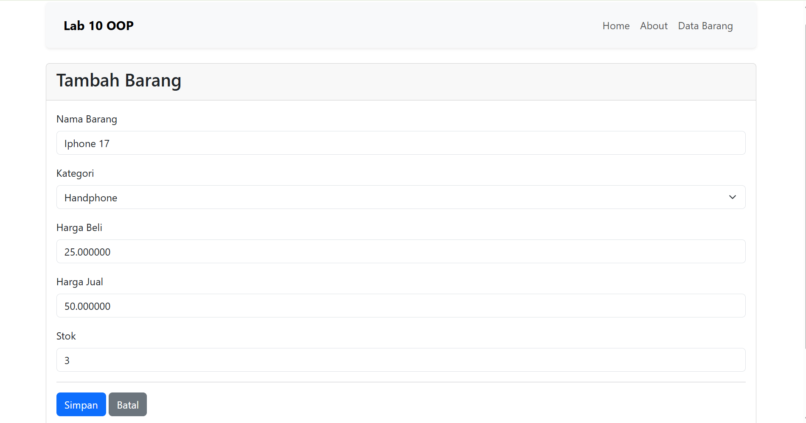
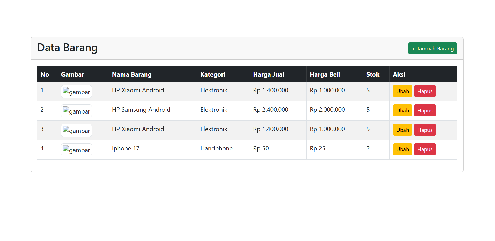

# Identitas Mahasiswa

**Nama :** Razy Alfarisi
**NIM :** 312410445  
**Kelas :** TI.24.A5  

---
# Lab10Web - PHP OOP dan Modularisasi

## Deskripsi
Praktikum 10 ini mengimplementasikan konsep Object Oriented Programming (OOP) dan Modularisasi pada PHP dengan menggunakan Class Library untuk Form dan Database Connection.

## Tujuan Praktikum
1. Memahami konsep dasar OOP (Object Oriented Programming)
2. Memahami konsep dasar Class dan Object
3. Membuat program OOP sederhana menggunakan PHP
4. Mengimplementasikan modularisasi dengan Class Library

## Struktur Direktori

```
lab10_php_oop/
├── config/
│   └── config.php              # Konfigurasi database dan aplikasi
├── class/
│   ├── database.php            # Class Library untuk database
│   └── form.php                # Class Library untuk form
├── templates/
│   ├── header.php              # Template header
│   └── footer.php              # Template footer
├── modules/
│   ├── home.php                # Halaman home
│   ├── about.php               # Halaman about
│   ├── 404.php                 # Halaman error 404
│   └── barang/                 # Module barang
│       ├── index.php           # List data barang
│       ├── tambah.php          # Tambah data
│       ├── ubah.php            # Edit data
│       └── hapus.php           # Hapus data
├── images/                     # Folder untuk gambar
├── style.css                   # File CSS
├── index.php                   # Main routing file
├── .htaccess                   # URL rewriting (optional)
└── README.md                   # Dokumentasi
```

## Konsep OOP yang Digunakan

### 1. Class (Kelas)
Class adalah blueprint atau template untuk membuat object. Dalam aplikasi ini terdapat 2 class utama:
- **Class Database**: Menangani koneksi dan operasi database
- **Class Form**: Membuat form input secara dinamis

### 2. Object (Objek)
Object adalah instance dari class. Contoh:
```php
$db = new Database();  // Membuat object dari class Database
$form = new Form();    // Membuat object dari class Form
```

### 3. Properties (Atribut)
Properties adalah variabel yang ada di dalam class. Contoh pada class Database:
```php
private $host;
private $user;
private $password;
private $db_name;
protected $conn;
```

### 4. Methods (Fungsi)
Methods adalah fungsi yang ada di dalam class. Contoh pada class Database:
```php
public function insert($table, $data) { ... }
public function update($table, $data, $where) { ... }
public function delete($table, $filter) { ... }
```

### 5. Constructor
Constructor adalah method yang otomatis dijalankan saat object dibuat:
```php
public function __construct() {
    $this->getConfig();
    $this->conn = new mysqli(...);
}
```

### 6. Encapsulation (Enkapsulasi)
Penggunaan visibility modifier untuk melindungi data:
- **private**: Hanya bisa diakses dari dalam class
- **protected**: Bisa diakses dari class dan turunannya
- **public**: Bisa diakses dari mana saja

## Class Library Database

Class Database menyediakan method untuk operasi CRUD:

### 1. Method `query($sql)`
Menjalankan query SQL custom:
```php
$db = new Database();
$result = $db->query("SELECT * FROM data_barang");
```

### 2. Method `get($table, $where)`
Mengambil satu data dari tabel:
```php
$data = $db->get('data_barang', "id_barang='1'");
```

### 3. Method `getAll($table, $where)`
Mengambil semua data dari tabel:
```php
$result = $db->getAll('data_barang');
```

### 4. Method `insert($table, $data)`
Menambah data ke tabel:
```php
$data = array(
    'nama' => 'Laptop',
    'harga' => 5000000
);
$db->insert('data_barang', $data);
```

### 5. Method `update($table, $data, $where)`
Mengubah data di tabel:
```php
$data = array('harga' => 6000000);
$db->update('data_barang', $data, "id_barang='1'");
```

### 6. Method `delete($table, $filter)`
Menghapus data dari tabel:
```php
$db->delete('data_barang', "WHERE id_barang='1'");
```

## Class Library Form

Class Form menyediakan cara mudah untuk membuat form input:

### Method `addField($name, $label, $type, $value, $options)`
Menambah field ke form:
```php
$form = new Form("action.php", "Submit");
$form->addField('nama', 'Nama Barang', 'text', '');
$form->addField('kategori', 'Kategori', 'select', '', $options);
$form->addField('deskripsi', 'Deskripsi', 'textarea', '');
$form->displayForm();
```

## Sistem Routing

Aplikasi menggunakan routing sederhana melalui parameter `page`:

### URL Format
```
index.php?page=module/action
```

### Contoh URL:
- Home: `index.php` atau `index.php?page=home`
- About: `index.php?page=about`
- List Barang: `index.php?page=barang`
- Tambah Barang: `index.php?page=barang/tambah`
- Edit Barang: `index.php?page=barang/ubah&id=1`
- Hapus Barang: `index.php?page=barang/hapus&id=1`

### SEO Friendly URL (dengan .htaccess)
Jika menggunakan .htaccess, URL bisa lebih sederhana:
- Home: `/lab10_php_oop/`
- About: `/lab10_php_oop/about`
- List Barang: `/lab10_php_oop/barang`
- Tambah: `/lab10_php_oop/barang/tambah`

## Template System

### Header Template
File `templates/header.php` berisi:
- HTML DOCTYPE dan meta tags
- Link ke CSS
- Header dengan judul aplikasi
- Navigasi menu

### Footer Template
File `templates/footer.php` berisi:
- Footer informasi
- Penutup HTML tags

Cara penggunaan:
```php
<?php 
$title = "Judul Halaman";
require('templates/header.php'); 
?>

<!-- Konten halaman -->

<?php require('templates/footer.php'); ?>
```

## Keunggulan Modularisasi

1. **Reusability**: Kode dapat digunakan berulang kali
   - Class Database digunakan di semua module
   - Template header/footer digunakan di semua halaman

2. **Maintainability**: Mudah dalam perawatan
   - Perubahan pada class hanya dilakukan di satu tempat
   - Update design hanya perlu mengubah template

3. **Scalability**: Mudah untuk dikembangkan
   - Tambah module baru tanpa mengubah kode lama
   - Tambah method baru ke class sesuai kebutuhan

4. **Organization**: Struktur kode terorganisir
   - Pemisahan berdasarkan fungsi (class, module, template)
   - Mudah mencari dan mengelola file

5. **Collaboration**: Memudahkan kerja tim
   - Developer bisa bekerja di module berbeda
   - Mengurangi konflik kode

## Instalasi dan Konfigurasi

### 1. Persiapan Database
Buat database dan tabel sesuai Praktikum sebelumnya:
```sql
CREATE DATABASE latihan1;
USE latihan1;

CREATE TABLE data_barang (
    id_barang INT AUTO_INCREMENT PRIMARY KEY,
    kategori VARCHAR(50),
    nama VARCHAR(100),
    harga_jual INT,
    harga_beli INT,
    stok INT,
    gambar VARCHAR(255)
);
```

### 2. Konfigurasi
Edit file `config/config.php` sesuai dengan konfigurasi database Anda:
```php
$config = array(
    'host' => 'localhost',
    'username' => 'root',
    'password' => '',
    'db_name' => 'latihan1'
);
```

### 3. Folder Images
Pastikan folder `images/` sudah dibuat dan memiliki permission untuk upload file.

### 4. Base URL
Sesuaikan BASE_URL di `config/config.php`:
```php
define('BASE_URL', 'http://localhost/lab10_php_oop/');
```

## Cara Penggunaan

### 1. Menampilkan Data
Akses: `index.php?page=barang`

### 2. Menambah Data
1. Klik tombol "Tambah Data Barang"
2. Isi form yang tersedia
3. Upload gambar (opsional)
4. Klik "Simpan Data"

### 3. Mengedit Data
1. Klik tombol "Edit" pada data yang ingin diubah
2. Ubah data pada form
3. Upload gambar baru jika ingin mengganti
4. Klik "Update Data"

### 4. Menghapus Data
1. Klik tombol "Hapus" pada data yang ingin dihapus
2. Konfirmasi penghapusan
3. Data dan gambar akan terhapus

## Screenshot

### 1. Halaman Home


### 2. Halaman About


### 3. Halaman List Data Barang


### 4. Halaman Tambah Barang


### 5. Hasil Setelah Tambah Barang


## Contoh Kode

### Menggunakan Class Database
```php
// Include class
require_once('class/database.php');

// Create instance
$db = new Database();

// Insert data
$data = array(
    'kategori' => 'Elektronik',
    'nama' => 'Laptop Asus',
    'harga_jual' => 7000000,
    'harga_beli' => 6000000,
    'stok' => 5
);
$db->insert('data_barang', $data);

// Get all data
$result = $db->getAll('data_barang');
while($row = $result->fetch_assoc()) {
    echo $row['nama'];
}

// Update data
$update_data = array('stok' => 10);
$db->update('data_barang', $update_data, "id_barang='1'");

// Delete data
$db->delete('data_barang', "WHERE id_barang='1'");
```

### Menggunakan Class Form
```php
// Include class
require_once('class/form.php');

// Create instance
$form = new Form("process.php", "Submit");

// Add fields
$form->addField('nama', 'Nama', 'text', '');
$form->addField('email', 'Email', 'text', '');
$form->addField('pesan', 'Pesan', 'textarea', '');

// Display form
$form->displayForm();
```

## Kesimpulan

Praktikum ini berhasil mengimplementasikan:
1.  Konsep OOP dengan Class dan Object
2.  Modularisasi kode program
3.  Class Library untuk Database dan Form
4.  Template System untuk konsistensi tampilan
5.  Routing System untuk URL yang terstruktur
6.  CRUD operations menggunakan OOP

## Lisensi
© 2024 Universitas Pelita Bangsa
